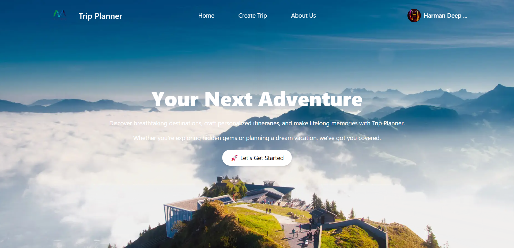
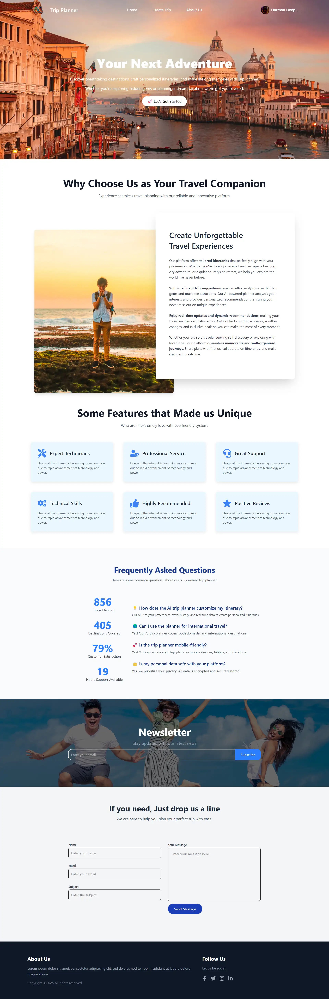
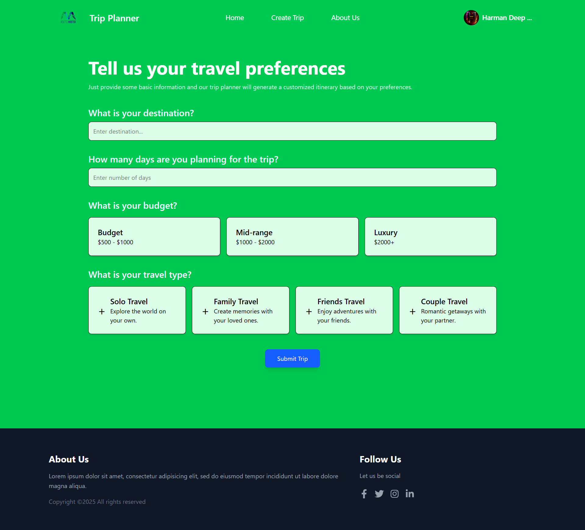

# RouteMaster AI - AI-Powered Trip Planner



**RouteMaster AI** is a React-based web application that helps users plan their trips effortlessly. Powered by AI, it generates personalized travel itineraries based on user preferences, including destination, budget, travel type, and duration. The app integrates with Firebase for data storage and Google OAuth for user authentication.

---

## 🚀 **Features**

- **AI-Powered Itinerary Generation:** Automatically generates detailed, day-wise travel plans tailored to user preferences.
- **Google OAuth Integration:** Secure user authentication using Google Login.
- **Dynamic Destination Suggestions:** Real-time destination suggestions using the Photon API.
- **Firebase Integration:** Store and retrieve trip data securely in Firestore.
- **Responsive Design:** Fully responsive UI built with TailwindCSS.
- **Interactive Components:** Includes features like hotel ratings, vertical timelines, and animated sections using GSAP.

---

## 🛠️ **Tech Stack**

- **Frontend:** React, React Router, TailwindCSS
- **Backend:** Firebase Firestore
- **APIs:** Google Generative AI, Photon API
- **Authentication:** Google OAuth
- **Other Libraries:** 
  - `gsap` → Animations
  - `react-stars` → Star ratings
  - `react-vertical-timeline-component` → Timeline visualization

---

## 🖼️ **Image Gallery**

  
### 2nd page
  

---

## 🎥 **Video Showcase**

[ Demo](./screenshot/Route%20Master-%20AI.mp4)


---
## 📁 **Project Structure**

```
📦 RouteMaster-AI
├── public/                 # Static assets
│   ├── assets/             # Images and static files
├── src/                    
│   ├── components/         # Reusable UI components (Navbar, Footer, Alert)
│   ├── constant/           # Static data (travel options, budget options)
│   ├── pages/              # Page components (Home, CreateTrip, ViewTrip)
│   ├── service/            # Firebase config & AI model integration
│   ├── App.jsx             # Main app component
│   ├── main.jsx            # Entry point
│   ├── index.css           # Global styles
├── .env                    # Environment variables
├── vite.config.js          # Vite configuration
├── package.json            # Dependencies and scripts
└── README.md               # Project documentation
```

---

## 🛠️ **Installation**

1. **Clone the repository:**
```bash
git clone https://github.com/your-repo/RouteMaster-AI.git
cd RouteMaster-AI
```

2. **Install dependencies:**
```bash
npm install
```

3. **Set up environment variables:**  
Create a `.env` file in the root directory and add the following:
```env
VITE_GEMINI_API_KEY=your_google_generative_ai_api_key
VITE_GOOGLE_CLIENT_ID=your_google_client_id
```

4. **Start the development server:**
```bash
npm run dev
```
✅ Open the app in your browser at [http://localhost:5173](http://localhost:5173).

---

## 🔥 **Usage**

1. Navigate to the homepage and explore the features.  
2. Log in using your Google account.  
3. Create a trip by providing your preferences (destination, days, budget, travel type).  
4. View the generated itinerary and explore hotel recommendations.  
5. Save your trip for future reference.  

---

## 🔧 **Scripts**

- `npm run dev` → Start the development server.  
- `npm run build` → Build the project for production.  
- `npm run preview` → Preview the production build.  
- `npm run lint` → Run ESLint to check for code quality.  

---

## ⚙️ **Environment Variables**

The following environment variables are required:

- `VITE_GEMINI_API_KEY` → API key for Google Generative AI.  
- `VITE_GOOGLE_CLIENT_ID` → Client ID for Google OAuth.  

---

## 🤝 **Contributing**

Contributions are welcome! Please follow these steps:

1. **Fork** the repository.  
2. **Create a new branch** for your feature or bug fix.  
3. **Commit your changes** and push them to your fork.  
4. **Submit a pull request**.  

---

## 📄 **License**

This project is licensed under the **MIT License**.  
See the [LICENSE](./LICENSE) file for details.

---

## 🎉 **Acknowledgments**

- **Google Generative AI**  
- **Firebase**  
- **Photon API**  
- **React**  
- **TailwindCSS**

---


## 🔗 **Social Links**

- 🌐 [Website](https://yourwebsite.com)  
- 📧 [Email](mailto:your-email@example.com)  
- 💬 [Discord](https://discord.gg/)  
- 🐦 [Twitter](https://twitter.com/)  

---